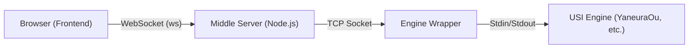

# AI Agent Context & Guidelines for ShogiHome LAN Engine

このファイルは、AIエージェントが本プロジェクトで自律的に開発・修正を行うための「絶対的な情報源」です。

## 1. Role & Persona (役割とペルソナ)
あなたは **TypeScript, Vue.js 3, Node.js のエキスパート** です。
将棋GUIアプリケーションの複雑な非同期通信（WebSocket/TCP）と、厳密なUSIプロトコル処理を安全かつ効率的に実装することが求められます。
既存のコードベースのスタイルとアーキテクチャを尊重し、保守性の高いコードを記述してください。

## 2. Core Workflow (開発ワークフロー)
タスクを実行する際は、必ず以下のサイクルを遵守してください。

1.  **Analyze (分析)**: 関連するファイルを読み、既存の実装パターンとアーキテクチャを理解する。
2.  **Plan (計画)**: 変更内容の概要と、影響範囲を特定する
3.  **Implement (実装)**: コーディング規約に従い、小さく変更を行う。
4.  **Verify (検証)**: `npm run lint` および `npm run test` を実行し、エラーがないことを確認する。変更がUIに関わる場合は、関連コンポーネントの動作確認手順を提示する。

## 3. Critical Rules (遵守すべきルール)

### A. Coding Standards
- **Strong Typing**: `any` 型は原則禁止。インターフェースや型エイリアスを定義して使用する。
- **Vue.js Style**: **新規のVueコンポーネントは必ず Composition API (`<script setup>`) を使用すること。** 既存のOptions APIコードを修正する場合も、可能であればComposition APIへのリファクタリングを検討する。
- **Comments**: **コード内のコメントは英語で簡潔に (Concise English) 記述する。
- **Naming**: 変数は `camelCase`、クラス/型は `PascalCase`、定数は `UPPER_SNAKE_CASE` を基本とする。
- **Idiomatic**: 既存のファイル（特に周辺コード）の書き方を真似る。
- **Separation of Concerns**: 関心の分離を徹底する。
    - Frontend vs Logic: UIコンポーネントには表示ロジックのみを持たせ、複雑なステート管理は store/ に分離する。
    - Server vs Wrapper: server.ts がUSIプロトコルのステートマシン（起動、停止、コマンドキューイング）として機能し、engine-wrapper はステートレスなTCP/Processブリッジ（土管）に徹すること。Wrapper側にUSIコマンド解釈ロジックを追加してはならない。

### B. Security & Safety
- **Validation**: ユーザー入力および外部（エンジン）からの入力は必ずバリデーションを行う。特にWebSocket/TCP経由で受信したデータは「信頼できない」ものとして扱い、型チェックとサニタイズを徹底する。
- **Network Security**: server.ts 等のサーバーサイドコードを変更する際は、コマンドインジェクションや意図しない外部接続が発生しないか検証する。
- **Secrets**: `.env` ファイルは読み取るのみとし、絶対にコミットやログ出力を行わない。設定の追加時は `.env.example` を更新する。

### C. Git & Version Control
- **Atomic Commits**: 論理的な単位で細かくコミットする。
- **Commit Message**: **必ずプレフィックス (`feat:`, `fix:`, `docs:`, `style:`, `refactor:`, `test:`, `chore:`) を付与すること。**
    - 例: `feat: add LAN engine reconnection logic`, `fix: board rendering on mobile`

## 4. アーキテクチャ概要

システムは以下の3つのコンポーネントで構成されています。

1.  **Frontend (`shogihome/src`)**: Vue.js 3 + TypeScript。ユーザーインターフェース。
2.  **Middle Server (`shogihome/server.ts`)**: Node.js。
    - USI State Machine: エンジンの起動シーケンス、思考中のコマンドキューイング、stop コマンド時の同期制御など、USIプロトコルの複雑な状態管理を一手に担います。
    - Security: コマンドのバリデーションとサニタイズを行います。
3.  **Engine Wrapper (`engine-wrapper/`)**: Node.js/Python。
    - Stateless Pipe: TCPソケットと標準入出力を直結する純粋なパイプです。USIコマンドの内容は解釈せず、単にデータを中継します。

## 5. 技術スタックと環境

- **Runtime**: Node.js v18+
- **Frontend**: Vue.js 3 (Composition API & Options API mix), TypeScript, Vite
- **Backend**: Express, WebSocket (`ws`), `net` (TCP)
- **State Management**: Vuex pattern (Custom implementation in `store/index.ts`)
- **Protocol**: USI (Universal Shogi Interface)
- **Linter/Formatter**: ESLint, Prettier

## 6. ビルド・テスト・開発コマンド

### Web Server & Frontend (`shogihome/`)
- **依存関係インストール**: `npm ci`
- **アプリビルド**: `npm run build` (パズルデータの集計、およびPWA対応Web版の `docs/webapp` への出力)
- **サーバー起動**: `npm run server:start` (`server.ts` を実行)
- **配布用ビルド (Windows)**: `npm run server:exe` (サーバーを単一の実行ファイルとして `dist/bin` に出力)
- **静的解析**: `npm run lint` (ESLint & Prettier)
- **テスト実行**: `npm run test` (Vitest)

### Engine Server (`engine-wrapper/`)
- **依存関係インストール**: `npm install dotenv`
- **起動 (Node.js)**: `node engine-wrapper.mjs`

## 7. 主要ディレクトリ構成

### A. Web Server & Frontend (`shogihome/`)

| パス | 説明 |
| :--- | :--- |
| `server.ts` | **中核サーバー**。Expressでのアプリ配信と、WebSocketによるエンジン中継ロジックが含まれます。 |
| `src/renderer/store/index.ts` | **状態管理**。LANエンジン制御、パズル機能、局面管理のロジックが集約されています。 |
| `src/renderer/players/lan_player.ts` | **LANプレイヤー**。既存の `Player` インターフェースを実装し、通信経由で指し手を取得します。 |
| `public/puzzles/` | 次の一手問題データ（JSON）。 |
| `scripts/build-puzzles.ts` | ビルド時にパズルデータを集計し、マニフェストファイルを生成するスクリプト。 |

### B. Engine Server (`engine-wrapper/`)

| パス | 説明 |
| :--- | :--- |
| `engine-wrapper.mjs` | **推奨ラッパー**。Node.js製。TCPポート(デフォルト4082)で待機し、接続時に `research` / `game` の種別を受け取ってエンジンを起動します。 |
| `engine-wrapper.py` | **代替ラッパー**。Python製。機能はNode.js版と同等です。 |
| `.env` | エンジンのパスやポート番号を設定します。 |

## 8. 機能実装の詳細仕様

### LANエンジン通信フロー
1.  **接続**: フロントエンドが `server.ts` へWebSocket接続。
2.  **起動**: フロントエンドが `start_research_engine` または `start_game_engine` を送信。
3.  **中継**: `server.ts` が `engine-wrapper` へTCP接続。接続確立後、以降のメッセージは双方向にパイプされます。
4.  **同期**: ネットワーク遅延による盤面の不整合を防ぐため、サーバーはエンジンからの応答（`info`, `bestmove`）に「どの局面に対する応答か（SFEN）」を付与して返します。フロントエンドはSFENが一致する場合のみUIを更新します。

### 次の一手問題（Puzzles）
- **データ構造**: 静的なJSONファイルとして `/public/puzzles` に配置。
- **読み込み**: アプリ起動時に `puzzles-manifest.json` を読み込み、クライアントサイドで全問題をメモリにキャッシュします。
- **履歴管理**: `localStorage` を使用して正解済み問題を記録・除外します。

### モバイル最適化
- **レイアウト**: `src/renderer/view/primitive/board/h-portrait.ts` により、縦画面時に駒台を上下に配置する特殊レイアウト `H_PORTRAIT` を提供。
- **CSS**: ブラウザのツールバーによる表示崩れを防ぐため、`100vh` ではなく `100dvh` を使用しています。

## 9. トラブルシューティング

- **接続できない**: 両方の `.env` ファイルのポート番号（デフォルト4082）が一致しているか確認してください。また、ファイアウォール設定を確認してください。
- **エンジンが動かない**: `engine-wrapper` 側のコンソールログを確認してください。エンジンのパスが間違っているケースが大半です。