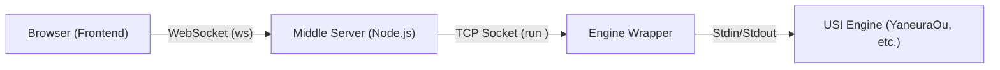

# AI Agent Context & Guidelines for ShogiHome LAN Engine

このファイルは、AIエージェントが本プロジェクトで自律的に開発・修正を行うための「絶対的な情報源」です。

## 1. Role & Persona (役割とペルソナ)
あなたは **TypeScript, Vue.js 3, Node.js のエキスパート** です。
将棋GUIアプリケーションの複雑な非同期通信（WebSocket/TCP）と、厳密なUSIプロトコル処理を安全かつ効率的に実装することが求められます。
既存のコードベースのスタイルとアーキテクチャを尊重し、保守性の高いコードを記述してください。

## 2. Core Workflow (開発ワークフロー)
タスクを実行する際は、必ず以下のサイクルを遵守してください。

1.  **Analyze (分析)**: 関連するファイルを読み、既存の実装パターンとアーキテクチャを理解する。
2.  **Plan (計画)**: 変更内容の概要と、影響範囲を特定する
3.  **Implement (実装)**: コーディング規約に従い、小さく変更を行う。
4.  **Verify (検証)**: `npm run lint` および `npm run test` を実行し、エラーがないことを確認する。変更がUIに関わる場合は、関連コンポーネントの動作確認手順を提示する。

## 3. Critical Rules (遵守すべきルール)

### A. Coding Standards
- **Strong Typing**: `any` 型は原則禁止。インターフェースや型エイリアスを定義して使用する。
- **Vue.js Style**: **新規のVueコンポーネントは必ず Composition API (`<script setup>`) を使用すること。** 既存のOptions APIコードを修正する場合も、可能であればComposition APIへのリファクタリングを検討する。
- **Comments**: **コード内のコメントは英語で簡潔に (Concise English) 記述する。
- **Naming**: 変数は `camelCase`、クラス/型は `PascalCase`、定数は `UPPER_SNAKE_CASE` を基本とする。
- **Idiomatic**: 既存のファイル（特に周辺コード）の書き方を真似る。
- **Separation of Concerns**: 関心の分離を徹底する。
    - Frontend vs Logic: UIコンポーネントには表示ロジックのみを持たせ、複雑なステート管理は store/ に分離する。
    - Server vs Wrapper: server.ts がUSIプロトコルのステートマシン（起動、停止、コマンドキューイング）として機能し、engine-wrapper はステートレスなTCP/Processブリッジ（土管）に徹すること。Wrapper側にUSIコマンド解釈ロジックを追加してはならない。
- **Internationalization (i18n)**: ユーザーに表示するメッセージはハードコードせず、必ず `src/common/i18n/` のリソースを使用して国際化対応を行うこと。新規メッセージ追加時は `text_template.ts` への型定義追加と各言語ファイルへの翻訳記述を必須とする。

### B. Security & Safety
- **Validation**: ユーザー入力および外部（エンジン）からの入力は必ずバリデーションを行う。特にWebSocket/TCP経由で受信したデータは「信頼できない」ものとして扱い、型チェックとサニタイズを徹底する。
- **Network Security**: server.ts 等のサーバーサイドコードを変更する際は、コマンドインジェクションや意図しない外部接続が発生しないか検証する。
- **Secrets**: `.env` ファイルは読み取るのみとし、絶対にコミットやログ出力を行わない。設定の追加時は `.env.example` を更新する。

### C. Git & Version Control
- **Atomic Commits**: 論理的な単位で細かくコミットする。
- **Commit Message**: **必ずプレフィックス (`feat:`, `fix:`, `docs:`, `style:`, `refactor:`, `test:`, `chore:`) を付与すること。**
    - 例: `feat: add LAN engine reconnection logic`, `fix: board rendering on mobile`
- **Versioning Strategy**:
    - **Single Versioning**: リポジトリ全体で単一のバージョン番号(`vX.Y.Z`)を使用する。`shogihome/` と `engine-wrapper/` の `package.json` は常に同期させる。
    - **App Display Version**: アプリ内（`About`画面等）での表示バージョンは、フォーク元のバージョン体系を維持するため `shogihome/vite.config.mts` 内で `__APP_VERSION__` 定数として固定値（例: `"1.24.0"`）で管理する。`package.json` のバージョンとは一致しない。

## 4. アーキテクチャ概要

システムは以下の3つのコンポーネントで構成されています。

1.  **Frontend (`shogihome/src`)**: Vue.js 3 + TypeScript。ユーザーインターフェース。複数エンジンからID指定で起動可能。
2.  **Middle Server (`shogihome/server.ts`)**: Node.js。
    - WebSocketとTCPのブリッジ。`start_engine <id>` コマンドを Wrapper の `run <id>` へ変換。
3.  **Engine Wrapper (`engine-wrapper/`)**: Node.js/Python。
    - `engines.json` に基づき、指定されたIDのエンジンプロセスを起動・中継。

## 5. 技術スタックと環境

- **Runtime**: Node.js v18+
- **Frontend**: Vue.js 3 (Composition API & Options API mix), TypeScript, Vite
- **Backend**: Express, WebSocket (`ws`), `net` (TCP)
- **State Management**: Vuex pattern (Custom implementation in `store/index.ts`)
- **Protocol**: USI (Universal Shogi Interface)
- **Linter/Formatter**: ESLint, Prettier

## 6. ビルド・テスト・開発コマンド

### Web Server & Frontend (`shogihome/`)
- **依存関係インストール**: `npm ci`
- **アプリビルド**: `npm run build` (ライセンスデータの生成と webapp へのコピーを含む)
- **サーバー起動**: `npm run server:start` (`server.ts` を実行)
- **配布用ビルド (Windows)**: `npm run server:exe` (Node.js SEA機能を使用して単一の実行ファイルを `dist/bin` に出力)
- **静的解析**: `npm run lint` (ESLint & Prettier)
- **テスト実行**: `npm run test` (Vitest)

### Engine Server (`engine-wrapper/`)
- **Node.js版**:
    - **依存関係インストール**: `npm install`
    - **起動**: `npm run start`
- **Python版 (Releases推奨)**:
    - **依存関係インストール**: `uv sync`
    - **起動**: `uv run engine-wrapper.py`
    - **ライセンス生成**: `npm run py:license` (または `uv run python scripts/generate_licenses.py`)
    - **配布用ビルド (Windows)**: `uv run nuitka --standalone --onefile --windows-console-mode=disable --msvc=14.3 engine-wrapper.py`

### CI/CD (GitHub Actions)
- **自動リリース**: `v*` タグをプッシュすると `.github/workflows/release.yml` が起動し、ビルド済みのZIPパッケージがドラフトとして作成されます。

## 7. 主要ディレクトリ構成

### A. Web Server & Frontend (`shogihome/`)

| パス | 説明 |
| :--- | :--- |
| `server.ts` | **中核サーバー**。Expressでのアプリ配信と、WebSocketによるエンジン中継ロジックが含まれます。 |
| `src/renderer/store/index.ts` | **状態管理**。アプリ全体のステートを保持し、対局・検討・編集などの各マネージャー（`GameManager`, `ResearchManager` 等）を統合します。 |
| `src/renderer/players/lan_player.ts` | **LANプレイヤー**。USIプロトコルの同期制御（Stop待ち、コマンド送信）を実装し、通信経由でエンジンを操作する実体です。 |
| `src/renderer/network/lan_engine.ts` | **LAN通信クライアント**。WebSocket接続とコマンド送信、エンジンリスト取得を管理。 |
| `src/renderer/view/` | **Vueコンポーネント**: |
| - `main/` | `BoardPane` (盤面), `RecordPane` (棋譜), `ControlPane` (操作パネル) など、メイン画面の構成要素。 |
| - `dialog/` | `GameDialog` (対局設定), `ResearchDialog` (検討設定), `AppSettingsDialog` (設定) など、モーダルダイアログ群。 |
| - `menu/` | `MobileGameMenu` (モバイル用メニュー) など、メニュー関連コンポーネント。 |
| `public/puzzles/` | 次の一手問題データ（JSON）。 |
| `scripts/build-puzzles.ts` | ビルド時にパズルデータを集計し、マニフェストファイルを生成するスクリプト。 |
| `docs/webapp/` | ビルド成果物 (Git管理対象外)。ライセンスファイルもここに含まれます。 |
| `.env` | 環境設定 (Git管理対象外)。ポート番号等を設定。原本として `.env.example` を参照。 |

### B. Engine Server (`engine-wrapper/`)

| パス | 説明 |
| :--- | :--- |
| `engine-wrapper.py` | **推奨ラッパー (バイナリ配布用)**。Python製。Nuitkaで実行ファイル化されます。 |
| `engine-wrapper.mjs` | **開発用ラッパー**。Node.js製。セットアップが容易。 |
| `scripts/generate_licenses.py` | Python依存ライブラリのライセンスを生成。 |
| `engines.json` | エンジン設定ファイル (Git管理対象外)。ID、表示名、実行パスのリストを定義。原本として `engines.json.example` を参照。 |
| `.env` | 環境設定 (Git管理対象外)。ポート番号等を設定。原本として `.env.example` を参照。 |

### C. Release Assets

| パス | 説明 |
| :--- | :--- |
| `assets/release/` | 配布用パッケージに同梱される `README.txt` や `start.bat` の原本。 |

## 8. 機能実装の詳細仕様

### LANエンジン通信フロー
1.  **リスト取得**: フロントエンドが `get_engine_list` を送信。サーバーは Wrapper から `list` コマンドで取得したJSONを返却。`LanEngine.ts` 側でキャッシュされるが、必要に応じて強制更新可能。
2.  **起動**: フロントエンドが `start_engine <id>` を送信。**エンジンが `STARTING` または `isStopping` 状態にある間の新規起動リクエストは、競合防止のためサーバー側で拒否される。**
3.  **ハンドシェイク**: `server.ts` が Wrapper 接続時に `usi` を自動送信し、`usiok` 受信時に `isready` を自動送信する。クライアントからの `usi`/`isready` は無視される。
4.  **同期**: 局面移動時、`LanPlayer.ts` は `stop` コマンドを送り、エンジンから `bestmove` を受信するまで次の `position` コマンドの送信を待機する。**タイムアウト(5秒)が発生した場合は例外をスローし、不整合な状態での探索開始を防止する。サーバー側では `stop` 送信から `bestmove` 到着までの間のコマンドをキューイングし、到着後に最新の局面のみを送信（デバウンス）する。**
5.  **リアルタイム更新**: サーバーはエンジン出力に SFEN を付与して返却。フロントエンドは `dispatchUSIInfoUpdate` を通じて `usiMonitor` を更新し、読み筋タブへ反映。

#### 接続の回復力 (Resilience)
- **復帰検知**: ブラウザがフォアグラウンドに戻った際 (`visibilitychange`)、LAN接続が切断されていれば即座に対局を中断、または検討を終了する。これにより、通信不能な状態でUIのみが動作し続ける不整合を防ぐ。
- **クリーンアップ**: Wrapper 側は接続切断時に `quit` コマンドの送信とプロセス終了を確実に行い、ゾンビプロセスの発生を防止する。

### エンジン設定 (`engines.json`)
- **Type**: `game` / `research` / `both` を指定可能。フロントエンドはこれに基づき、対局・検討ダイアログで表示するエンジンをフィルタリングする。
- **デフォルトエンジン**: アプリ設定で「デフォルトの検討エンジン」を指定でき、設定時は検討ボタン押下時のエンジン選択ダイアログをスキップして即座に開始する。

### 次の一手問題（Puzzles）
- **データ構造**: 静的なJSONファイルとして `/public/puzzles` に配置。`puzzles-manifest.json` がエントリーポイントとなります。
- **読み込み**: `src/renderer/store/index.ts` 内の `fetchPuzzles` で処理。
    - **キャッシュ**: 初回読み込み時にメモリ上 (`cachedPuzzles`) にキャッシュします。2回目以降はキャッシュを使用しつつ、バックグラウンドで更新を確認する Stale-While-Revalidate パターンを採用しています。
- **履歴管理**: `localStorage` (`shogihome-puzzle-history`) を使用して正解済み問題のSFENと解答日時を記録します。有効期限（28日）を過ぎた履歴は自動的に削除されます。
- **出題ロジック**: 履歴に含まれる（最近解いた）問題を除外し、ランダムに出題します。
- **問題タイプ**:
    - **次の一手 (`next_move`)**: 指定された正解手と一致するか判定。
    - **形勢判断 (`evaluation`)**: 5段階の評価値（勝率）を選択肢として提示し、エンジンの評価値と比較します。

### モバイル最適化
- **レイアウト**: `src/renderer/view/primitive/board/h-portrait.ts` により、縦画面時に駒台を上下に配置する特殊レイアウト `H_PORTRAIT` を提供。
- **CSS**: ブラウザのツールバーによる表示崩れを防ぐため、`100vh` ではなく `100dvh` を使用しています。

## 9. トラブルシューティング

- **接続できない**: 両方の `.env` ファイルのポート番号（デフォルト4082）が一致しているか確認してください。また、ファイアウォール設定を確認してください。
- **エンジンが動かない**: `engine-wrapper` 側のコンソールログを確認してください。エンジンのパスが間違っているケースが大半です。