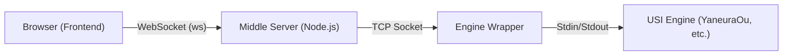

# Project Context & Development Guidelines

このファイルは、AIアシスタント（エージェント）が **ShogiHome LAN Engine** のコードベースを理解し、開発を行うための主要なコンテキストとガイドラインを提供します。

## 1. プロジェクトの定義

**ShogiHome LAN Engine** は、将棋GUIである `ShogiHome` のフォークプロジェクトです。
最大の特徴は、**「思考エンジンの分離」** です。スマートフォンなどの端末（フロントエンド）から、LAN内の高性能PC上で動作する将棋エンジン（バックエンド）を操作し、検討や対局を行うことができます。

## 2. アーキテクチャ概要

システムは以下の3つのコンポーネントで構成されています。

1.  **Frontend (`shogihome/src`)**: Vue.js 3 + TypeScript。ユーザーインターフェース。
2.  **Middle Server (`shogihome/server.ts`)**: Node.js。静的ファイルの配信と、WebSocket <-> TCP のプロトコル変換（ブリッジ）を担当。
3.  **Engine Wrapper (`engine-wrapper/`)**: Node.js/Python。実際のUSIエンジンプロセスを管理し、TCP経由でコマンドを受け付けます。

## 3. 技術スタックと環境

- **Runtime**: Node.js v18+
- **Frontend**: Vue.js 3 (Composition API & Options API mix), TypeScript, Vite
- **Backend**: Express, WebSocket (`ws`), `net` (TCP)
- **State Management**: Vuex pattern (Custom implementation in `store/index.ts`)
- **Protocol**: USI (Universal Shogi Interface)
- **Linter/Formatter**: ESLint, Prettier

## 4. ビルド・テスト・開発コマンド

### Web Server & Frontend (`shogihome/`)
- **依存関係インストール**: `npm ci`
- **アプリビルド**: `npm run build` (パズルデータの集計、およびPWA対応Web版の `docs/webapp` への出力)
- **サーバー起動**: `npm run server:start` (`server.ts` を実行)
- **配布用ビルド (Windows)**: `npm run server:exe` (サーバーを単一の実行ファイルとして `dist/bin` に出力)
- **静的解析**: `npm run lint` (ESLint & Prettier)
- **テスト実行**: `npm run test` (Vitest)

### Engine Server (`engine-wrapper/`)
- **依存関係インストール**: `npm install dotenv`
- **起動 (Node.js)**: `node engine-wrapper.mjs`

## 5. 開発・コーディングガイドライン

### コーディングスタイル
- **言語**: 原則として TypeScript を使用してください。
- **命名規則**: 変数・関数名は `camelCase`、クラス名は `PascalCase`、定数は `UPPER_SNAKE_CASE` を基本とします。
- **フォーマット**: Prettier の設定（`.prettierrc.cjs`）に従ってください。保存時に自動整形される環境を推奨します。
- **型定義**: `any` を避け、可能な限りインターフェースや型エイリアスを定義してください。

### テスト手順
- **単体テスト**: `shogihome/src/tests` 配下にテストコードを配置し、`npm run test` で結果を確認してください。
- **結合テスト**: 
    1. `engine-wrapper` を起動。
    2. `shogihome` サーバーを起動。
    3. ブラウザでアクセスし、開発者ツールの Network タブで WebSocket 通信が正常か確認してください。

### セキュリティに関する注意事項
- **入力バリデーション**: `server.ts` の `isValidUsiCommand` 関数のように、外部（クライアント）からの入力は必ず検証し、不正なコマンドやOSインジェクションを防いでください。
- **認証**: 現状、LAN内利用を想定しているため認証機能はありませんが、`ALLOWED_ORIGINS` の設定により不適切なオリジンからのアクセスを制限しています。
- **秘密情報**: `.env` ファイルは Git にコミットしないでください。設定の追加時は `.env.example` を更新してください。

## 6. 主要ディレクトリ構成

### A. Web Server & Frontend (`shogihome/`)

| パス | 説明 |
| :--- | :--- |
| `server.ts` | **中核サーバー**。Expressでのアプリ配信と、WebSocketによるエンジン中継ロジックが含まれます。 |
| `src/renderer/store/index.ts` | **状態管理**。LANエンジン制御、パズル機能、局面管理のロジックが集約されています。 |
| `src/renderer/players/lan_player.ts` | **LANプレイヤー**。既存の `Player` インターフェースを実装し、通信経由で指し手を取得します。 |
| `public/puzzles/` | 次の一手問題データ（JSON）。 |
| `scripts/build-puzzles.ts` | ビルド時にパズルデータを集計し、マニフェストファイルを生成するスクリプト。 |

### B. Engine Server (`engine-wrapper/`)

| パス | 説明 |
| :--- | :--- |
| `engine-wrapper.mjs` | **推奨ラッパー**。Node.js製。TCPポート(デフォルト4082)で待機し、接続時に `research` / `game` の種別を受け取ってエンジンを起動します。 |
| `engine-wrapper.py` | **代替ラッパー**。Python製。機能はNode.js版と同等です。 |
| `.env` | エンジンのパスやポート番号を設定します。 |

## 5. 機能実装の詳細仕様

### LANエンジン通信フロー
1.  **接続**: フロントエンドが `server.ts` へWebSocket接続。
2.  **起動**: フロントエンドが `start_research_engine` または `start_game_engine` を送信。
3.  **中継**: `server.ts` が `engine-wrapper` へTCP接続。接続確立後、以降のメッセージは双方向にパイプされます。
4.  **同期**: ネットワーク遅延による盤面の不整合を防ぐため、サーバーはエンジンからの応答（`info`, `bestmove`）に「どの局面に対する応答か（SFEN）」を付与して返します。フロントエンドはSFENが一致する場合のみUIを更新します。

### 次の一手問題（Puzzles）
- **データ構造**: 静的なJSONファイルとして `/public/puzzles` に配置。
- **読み込み**: アプリ起動時に `puzzles-manifest.json` を読み込み、クライアントサイドで全問題をメモリにキャッシュします。
- **履歴管理**: `localStorage` を使用して正解済み問題を記録・除外します。

### モバイル最適化
- **レイアウト**: `src/renderer/view/primitive/board/h-portrait.ts` により、縦画面時に駒台を上下に配置する特殊レイアウト `H_PORTRAIT` を提供。
- **CSS**: ブラウザのツールバーによる表示崩れを防ぐため、`100vh` ではなく `100dvh` を使用しています。

## 6. 開発ガイドライン

1.  **USIプロトコルの厳守**: エンジンとの通信はすべてUSIプロトコルに準拠してください。独自のコマンドを追加する場合は、既存のUSIコマンドと衝突しないように注意してください。
2.  **安全性**: `server.ts` は外部からの接続を受け入れる可能性があります（`.env`の設定による）。OSコマンドインジェクションなどを防ぐため、クライアントからの入力は厳密に検証してください。
3.  **既存コードの尊重**: `shogihome` はフォーク元が存在するプロジェクトです。可能な限り元のディレクトリ構造や命名規則（キャメルケース等）に従ってください。
4.  **コメント**: 複雑な非同期処理（特に通信周り）には、意図を説明するコメントを記述してください。

## 7. トラブルシューティング

- **接続できない**: 両方の `.env` ファイルのポート番号（デフォルト4082）が一致しているか確認してください。また、ファイアウォール設定を確認してください。
- **エンジンが動かない**: `engine-wrapper` 側のコンソールログを確認してください。エンジンのパスが間違っているケースが大半です。
