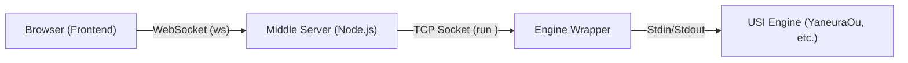

# ShogiHome LAN Engine

> [!WARNING]
> **試験運用中 (Experimental)**
>
> 本プロジェクトは現在、個人的な検証および限定的なテスト運用を目的として公開されています。
> 予期せぬ不具合が含まれる可能性があり、将来的に仕様が変更される場合があります。

[](https://deepmind.google/technologies/gemini/)
[](https://github.com/yoset77/shogihome-lan/actions/workflows/test.yml)

[ShogiHome](https://github.com/sunfish-shogi/shogihome) をフォークし、サーバーサイドでUSIエンジンを実行する機能を追加した改造版です。  
PC上のUSI将棋エンジンをLAN内のスマートフォンやタブレットからWebブラウザ経由で利用し、ShogiHomeの快適なUIで局面の検討や対局を行うことができます。

> **セキュリティに関する注意**
> 
> 本アプリケーションは、**信頼できるプライベートネットワーク（自宅のWi-FiやVPN内など）での個人利用**を前提に設計されています。
> ポート開放を行ってインターネットに直接公開することは推奨しません。外出先からの利用にはVPN（Tailscale等）をご利用ください。

## スクリーンショット
<table>
  <tr>
    <td align="center">
      
    <br>
     <em>検討画面</em>
    </td>
    <td align="center">
      
    <br>
     <em>PVプレビュー画面</em>
    </td>
  </tr>
</table>

## 主な機能

- **LANエンジン対局・検討:** PC上の強力なUSIエンジンを、スマホやタブレットのブラウザから利用できます。
- **セッション継続機能:** ネットワークの一時的な切断が発生しても、サーバー側でエンジンプロセスを一定時間（デフォルト60秒）維持し、再接続時に状態を復元します。
- **ハートビート監視:** クライアント・サーバー間で定期的な PING/PONG を行い、切断を検知した場合は自動で再接続を試みます。
- **次の一手問題:** SFEN形式の局面データをJSONファイルとして配置することで、アプリ上で次の一手問題を出題・解答できます。

---

## ディレクトリ構成

本リポジトリは、以下の2つの主要なモジュールで構成されています。

- **`shogihome/`**: Webサーバーおよびフロントエンド（TypeScript/Vue.js）。
- **`engine-wrapper/`**: 将棋エンジンを制御するエンジンラッパー（Node.js/Python）。`engines.json` で複数のエンジンを管理します。

---

## 利用方法

### A. 配布パッケージ（exe）を利用する場合

[Releases](https://github.com/yoset77/shogihome-lan/releases) からWindows用のビルド済みファイルをダウンロードできます。

詳細なセットアップ手順やトラブルシューティングについては、同梱の **[ユーザーガイド (README.txt)](./assets/release/README.txt)** を参照してください。

1.  ダウンロードしたファイルを展開します。
2.  `README.txt` を参考にセットアップを行ってください。
3.  Node.js や Python などのインストールは不要です。

### B. ソースコードから実行・ビルドする場合

#### 前提条件
- **Node.js:** v20以上

#### 1. インストール

```shell
git clone https://github.com/yoset77/shogihome-lan.git
cd shogihome-lan
```

#### 2. Webサーバー (shogihome) のセットアップ

```shell
cd shogihome
npm ci

# 設定ファイルの作成
cp .env.example .env
# .env を編集して PORT=8080 等を設定
```

#### 3. エンジンラッパー (engine-wrapper) のセットアップ

```shell
cd engine-wrapper

# Node.js版を使う場合
npm install 
cp .env.example .env
# engines.json の作成
cp engines.json.example engines.json
# エンジンパス等を設定
```

#### 4. サーバーの起動

**Webサーバー:**
```shell
cd shogihome
npm run build
npm run server:start
```

**エンジンラッパー:**
```shell
cd engine-wrapper
npm run start
```
---

## アーキテクチャ概要

本アプリケーションは、Webサーバーとエンジンラッパーの役割が分離されています。



- **エンジンラッパー (`engine-wrapper`):**
  - 将棋エンジン（`YaneuraOu`など）を管理し、TCPソケット(4082番)で待ち受けます。
  - フロントエンドからのリクエストに応じてエンジンを起動・操作します。

- **Webサーバー (`shogihome`):**
  - ブラウザ向けにShogiHomeのアプリ画面（HTML/JS）を配信します(8080番)。
  - ブラウザからのWebSocket通信を、TCP通信に変換してエンジンラッパーに中継します。

### セキュリティ機能

本アプリケーションは、LAN内での利用を前提として、以下のセキュリティ対策を実装しています。

- **USIコマンドバリデーション:** サーバー側でコマンドを検証し、コマンドインジェクションを防ぎます。
- **オリジン制限:** WebSocket接続時にオリジンを検証し、許可されたオリジン以外からの接続を拒否します。
- **HTTPヘッダー保護:** Helmetを使用し、適切なCSP (Content Security Policy) 等を設定しています。

---

## 応用

### 外部からのアクセス (VPN / PWA)

[Tailscale](https://tailscale.com/) などのVPNサービスを利用することで、外出先からもアクセスすることができます。

1.  **VPN接続:** PCとスマホをVPN（Tailscale等）で接続します。
2.  **アクセス:** スマホのブラウザから `http://[PCのIPアドレス]:8080` にアクセスします。
3.  **HTTPS化 (オプション):** `tailscale serve` などを使うことで、HTTPS化してPWAとしてインストールすることも可能です。

---

## コントリビューション

本プロジェクトは個人の趣味として開発されており、メンテナンスのリソースが限られています。  
そのため、**Issue や Pull Request をいただいても、対応できない場合や返信が遅れる場合があります。**
あらかじめご了承ください。

---

## Licences

### ShogiHome

[MIT License](LICENSE)

### Icon Images

[/public/icon](https://github.com/sunfish-shogi/shogihome/tree/main/public/icon) 配下のアイコン画像は [Material Icons](https://google.github.io/material-design-icons/) を使用しています。
これには [Apache License 2.0](https://www.apache.org/licenses/LICENSE-2.0.txt) が適用されます。

### Dependencies

レンダラープロセスで使用しているライブラリは [THIRD PARTY LICENSES](https://sunfish-shogi.github.io/shogihome/third-party-licenses.html) を参照してください。

---

## AI-Powered Development

This project is primarily developed and maintained using the **Gemini CLI**.

The development workflow leverages autonomous AI agents to implement features, refactor code, and fix bugs based on the guidelines defined in [AGENTS.md](AGENTS.md). 

- **Agent**: Gemini CLI
- **Context Management**: Guided by `AGENTS.md` in the root directory.
